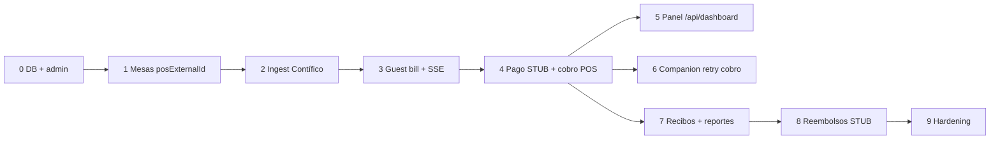

# MesitaQR — Presentación de handoff (auditoría dura · Jun 2026)

Integración **Contífico sandbox (APIPRUEBA)** + **pagos STUB** (Kushki eliminado). Diners queda como placeholder. Esta versión refleja una **auditoría fase por fase** con tests, agentes de revisión y smoke en **Vercel producción**.

**Producción:** https://mesitademo-two.vercel.app  
**Repo app:** `mesita-app`  
**Plan detallado:** `docs/INTEGRATION_PLAN.md`

---

## Veredicto ejecutivo (honesto)

| Superficie | Estado |
|------------|--------|
| **Demo público** (`/pay/demo`) | ✅ Funciona en Vercel (200) |
| **API guest demo** | ✅ `GET /api/guest/bill/demo` → 200 |
| **Panel owner (Postgres)** | ✅ Código listo; requiere login |
| **Restaurante real E2E** | ⚠️ **No cerrado** — PREs sandbox sin `adicional1` mapeado |
| **Deploy último código** | ⚠️ Cambios locales pueden no estar en Vercel hasta push + redeploy |
| **Tests** | ⚠️ **402/409 pasan**; 7 fallos pre-existentes (demo-store + CSS receipt) |

**Conclusión:** El **esqueleto de integración está bien encadenado** (cada fase alimenta la siguiente en código), pero **mañana** hay que: (1) desplegar migración + env `PAYMENT_PROVIDER=STUB`, (2) mapear PRE Contífico → mesa, (3) probar ingest → QR → pago → panel.

---

## Cadena fase → fase (¿cada una ayuda a la siguiente?)



| Enlace | ¿Bien diseñado? | Evidencia |
|--------|-----------------|-----------|
| 0→1 | ✅ | Prisma + seed; mesas con `posExternalId` |
| 1→2 | ✅ | Ingest filtra por `posExternalId` = campo Contífico (`adicional1`) |
| 2→3 | ✅ | `pos-on-scan` en `guest/bill/[token]` crea/actualiza Bill |
| 3→4 | ✅ | `PaymentStage` → `POST .../pay` → `process-payment` |
| 4→5 | ✅ | Panel lee pagos/bills vía `/api/dashboard` |
| 4→6 | ✅ | Companion lista cobros no registrados; POST retry |
| 4→7 | ✅ | `/api/reports/payments` devuelve lista + KPIs |
| 7→8 | ✅ | Lista en reembolsos → detalle `[billId]` → `POST .../refund` |
| 8→9 | ⚠️ | Menu + config aún tocan `demo-pos`; tests demo en rojo |

---

## Tabla por fase (auditoría dura)

| Fase | Estado | Qué funciona | Qué falta / riesgo |
|------|--------|--------------|-------------------|
| **0** | **COMPLETE** | DB Supabase, migraciones, admin login, register, Vercel env base | Limpiar restaurantes smoke-test huérfanos (opcional) |
| **1** | **COMPLETE** | CRUD mesas, QR, `posExternalId`, gates ACTIVE/TRIAL | `configuracion` aún consulta `demo-pos` para detectar modo demo |
| **2** | **PARTIAL** | `POST /api/pos/ingest`, cron hourly, `test-contifico.mjs` OK, tests ingest | **E2E no probado en prod**; 7 PRE abiertos con `adicional1` vacío |
| **3** | **PARTIAL** | Guest path Postgres, SSE, split modes, tests guest API | Bill real solo tras ingest; 2 teléfonos no verificados manualmente |
| **4** | **PARTIAL** | STUB `stub:*`, cobro Contífico best-effort, `updatePosRegistration` | Sin procesador real (Diners); cobro TC puede fallar en sandbox |
| **5** | **COMPLETE** | `PanelDashboard` → `/api/dashboard`, poll 5s, estados mesa | Drawer detalle mesa no implementado |
| **6** | **COMPLETE** | Companion GET/PATCH/POST retry, totales `posTotal` | Probar alerta `POS_COBRO_FAILED` manualmente |
| **7** | **PARTIAL** | `/api/reports/payments` + propinas; estadísticas → dashboard | Recibo guest: 2 tests CSS fallan; menu owner sigue en demo-pos |
| **8** | **PARTIAL** | Refund STUB en API + UI `[billId]` | Lista principal ahora usa Postgres (fix en esta auditoría) |
| **9** | **PARTIAL** | Build ✅, Kushki removido, rebrand parcial | `menu/page.tsx` 100% demo-pos; 7 tests rojos; health-check UI ausente |

---

## Bugs corregidos en esta auditoría

| Fix | Archivo |
|-----|---------|
| Build roto (`DemoBanner` sin usar) | `PanelDashboard.tsx` |
| Banner demo en panel producción | Eliminado de `PanelDashboard` + `StatisticsDashboard` |
| Reportes owner leían demo Redis | `reembolsos/page.tsx` → `/api/reports/payments` |
| API reportes sin lista de pagos | `api/reports/payments/route.ts` añade `payments[]` |
| Cobro neto vs propina voluntaria | `process-payment.ts` (sesión anterior) |
| Registro POS tras cobro | `updatePosRegistration()` en repositorio |
| Rebrand residual | `personal/page.tsx` PagaYa → MesitaQR |

---

## Pagos: Kushki → STUB / Diners

| Antes | Ahora |
|-------|-------|
| Kushki checkout + webhook | **Eliminado** |
| `kushkiTransactionId` | `providerTransactionId` |
| Tarjeta real | Botón fake → `paymentToken: stub:XXXX` |
| Env `KUSHKI_*` | `PAYMENT_PROVIDER=STUB` (default) |

**Archivos clave:**
- `src/modules/payments/adapters/stub/client.ts`
- `src/modules/payments/adapters/diners/client.ts` (placeholder)
- `src/modules/payments/adapters/resolve.ts`
- Migración: `prisma/migrations/20260630100000_payment_provider_stub/`

**Activar Diners (futuro):** `PAYMENT_PROVIDER=DINERS` + implementar `charge()` / `refund()` en adapter Diners.

---

## Contífico sandbox

| Item | Valor |
|------|-------|
| UI | contifico.com → **APIPRUEBA** / **APIPRUEBA** |
| API base | `https://integracionapi.contifico.com/sistema/api/v2` |
| Script smoke | `node scripts/test-contifico.mjs` |
| Ingest manual | `CRON_SECRET=… APP_URL=https://mesitademo-two.vercel.app npx tsx scripts/test-ingest.ts` |

**Bloqueador actual:** los PRE abiertos en sandbox tienen `adicional1="(empty)"`. Debes crear un PRE con `adicional1` = **exactamente** el `posExternalId` de la mesa en Mesita.

---

## Verificación Vercel (29 jun 2026)

| Endpoint | HTTP | Notas |
|----------|------|-------|
| `/pay/demo` | **200** | Flujo comensal demo OK |
| `/api/guest/bill/demo` | **200** | Bill seeded `PARTIALLY_PAID` |
| `/api/dashboard` | **401** | Correcto sin sesión |
| `/admin/login` | **200** | Admin accesible |

**No verificado en prod (requiere deploy + datos):**
- Pago STUB con bill real
- Panel owner tras login
- Migración `20260630100000` aplicada en Supabase
- Ingest E2E

---

## Tests ejecutados

```bash
npm run build          # ✅ OK
npm test               # 402 passed, 7 failed (demo-store + receipt CSS)
npm test -- src/modules/payments src/app/api/bills  # ✅ 19/19
node scripts/test-contifico.mjs  # ✅ API sandbox responde
```

**Fallos conocidos (no bloquean integración core):**
- `demo-table-store/*` — catálogo demo Redis
- `guest-billing/receipt-peek-layout.test.ts` — contrato CSS

---

## Demo leakage restante (owner dashboard)

| Página | Fuente datos | Acción mañana |
|--------|--------------|---------------|
| `panel` | `/api/dashboard` | ✅ Listo |
| `estadisticas` | `/api/dashboard` | ✅ Listo |
| `reembolsos` | `/api/reports/payments` | ✅ Corregido en auditoría |
| `companion` | `/api/pos-companion/payments` | ✅ Listo |
| `mesas` | `/api/tables` | ✅ Listo |
| **`menu`** | **`/api/demo-pos`** | ⚠️ Sigue en demo — no usar para restaurante real |
| **`configuracion`** | Prisma + probe `demo-pos` | ⚠️ Quitar probe o aislar solo demo |

---

## Checklist para mañana (orden recomendado)

### 1. Deploy y base de datos

```bash
cd mesita-app
git add -A && git commit -m "…" && git push   # si quieres Vercel actualizado
npx prisma migrate deploy
```

**Vercel → Environment Variables:**
- `PAYMENT_PROVIDER` = `STUB`
- Eliminar `KUSHKI_*` / `NEXT_PUBLIC_KUSHKI_*`
- Mantener: `DATABASE_URL`, `DIRECT_URL`, `ENCRYPTION_KEY`, `CRON_SECRET`, `NEXTAUTH_*`

→ **Redeploy**

### 2. Contífico — PRE mapeado

1. Login APIPRUEBA en Contífico Online
2. Crear **prefactura (PRE)** con ítems
3. Campo **`adicional1`** = p.ej. `Mesa-Test-1`

### 3. Mesita — configurar restaurante

1. [Configuración](https://mesitademo-two.vercel.app/dashboard/owner/configuracion)
2. Contífico: SANDBOX, API key, campo mesa = `adicional1`, POS activo
3. Mesas: **Nombre en el POS** = `Mesa-Test-1`
4. Pagos: activar (STUB)
5. Restaurante **ACTIVE**

### 4. Ingest + prueba comensal

```bash
CRON_SECRET=tu_secret APP_URL=https://mesitademo-two.vercel.app npx tsx scripts/test-ingest.ts
```

1. Escanear QR de la mesa
2. Ver ítems y `posTotal`
3. Pagar con tarjeta fake (autollenar)
4. Ver recibo / éxito

### 5. Verificar owner

1. **Panel** — mesa pasa a pagada
2. **Pagos y reembolsos** — aparece el pago
3. **Companion** — si cobro POS falló, reintentar
4. **Contífico UI** — PRE con cobro (EF suele funcionar mejor que TC en sandbox)

### 6. Script opcional de pago

```bash
BILL_ID=... TABLE_TOKEN=... APP_URL=https://mesitademo-two.vercel.app npx tsx scripts/test-payment-flow.ts
```

---

## Screenshots sugeridos (`docs/screenshots/`)

1. `phase-2-config-contifico.png` — Config Contífico SANDBOX
2. `phase-2-mesas-pos-id.png` — Mesa con Nombre en el POS
3. `phase-3-guest-bill.png` — `/pay/{token}` con ítems del PRE
4. `phase-4-payment-success.png` — Éxito tras stub pay
5. `phase-5-panel.png` — Panel con mesa pagada
6. `phase-6-companion.png` — Companion cobro pendiente
7. `phase-7-reembolsos.png` — Lista pagos Postgres
8. `phase-contifico-ui.png` — PRE/cobro en APIPRUEBA

---

## Qué NO se pudo (sin mentir)

| Item | Motivo |
|------|--------|
| Pagos reales Diners | Sin credenciales banco |
| Kushki | Eliminado a pedido |
| Factura SRI real | Solo sandbox |
| E2E ingest→pago en prod | PREs sin `adicional1`; código no desplegado |
| Cron cada 1 min | Vercel Hobby = hourly; on-scan compensa |
| Menu owner producción | Sigue en demo-pos |
| Suite tests 100% verde | 7 fallos demo/CSS pre-existentes |

---

## Arquitectura de pago (cuando llegue Diners)

1. Credenciales Diners
2. `PAYMENT_PROVIDER=DINERS` en Vercel
3. Configuración → claves
4. Implementar `charge()` / `refund()` en `adapters/diners/client.ts`
5. UI guest y `POST /api/bills/.../pay` **no cambian**

---

## Comandos rápidos

```bash
# Contífico
node scripts/test-contifico.mjs

# Tests integración pagos
npm test -- src/modules/payments src/app/api/bills src/modules/pos/application

# Build producción
npm run build

# Ingest producción
CRON_SECRET=... APP_URL=https://mesitademo-two.vercel.app npx tsx scripts/test-ingest.ts
```

---

*Generado tras auditoría dura Fases 0–9, correcciones de demo leakage, smoke Vercel y tests — 29 jun 2026.*
